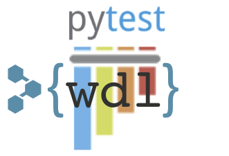

[](https://travis-ci.com/EliLillyCo/pytest-wdl)
[](https://codecov.io/gh/elilillyco/pytest-wdl)
[](https://pytest-wdl.readthedocs.io/en/latest/?badge=latest)



This package is a plugin for the [pytest](https://docs.pytest.org/en/latest/) unit testing framework that enables testing of workflows written in [Workflow Description Language](https://github.com/openwdl).

## Dependencies

* Python 3.6+
* At least one of the supported workflow engines:
    * [Miniwdl](https://github.com/chanzuckerberg/miniwdl) - automatically installed as a dependency of pytest-wdl
    * [Cromwell](https://github.com/broadinstitute/cromwell/releases/tag/53.1) JAR file
        * **Cromwell Server**: Any Cromwell instance remotely running in Server mode
    * [dxWDL](https://github.com/dnanexus/dxWDL) JAR file
* Java-based workflow engines (e.g. Cromwell and dxWDL) require a Java runtime (typically 1.8+)
* If your WDL tasks depend on Docker images, make sure to have the [Docker](https://www.docker.com/get-started) daemon running

Other python dependencies are installed when you install the library.

## Installation

### Install from PyPI

```commandline
$ pip install pytest-wdl
```

### Install from source

You can to clone the repository and install:

```
$ make install
```

Or use pip to install from github:

```commandline
$ pip install git+https://github.com/elilillyco/pytest-wdl.git
```

### Install optional dependencies

Some optional features of pytest-wdl have additional dependencies that are loaded on-demand.

The plugins that have extra dependencies are:

* dx: Support for DNAnexus file storage, and for the dxWDL executor.
* bam: More intelligent comparison of expected and actual BAM file outputs of a workflow than just comparing MD5 checksums.
* http: Support for executors that use HTTPS protocol to communicate with a remote server (e.g. Cromwell Server)
* yaml: Support using YAML for configuration and test data files.
* progress: Show progress bars when downloading remote files.

To install a plugin's dependencies:

```
$ pip install pytest-wdl[<plugin>]
```

To do this locally, you can clone the repo and run:

```commandline
$ pip install -e .[<data_type>]
```

To install pytest-wdl and **all** extras dependencies:

```
$ pip install pytest-wdl[all]
```

## Usage

The pytest-wdl plugin provides a set of fixtures for use with pytest. Here is a quick example that tests the following workflow.

```wdl
# variant_caller.wdl
version 1.0

import "variant_caller.wdl"

struct Index {
  File fasta
  String organism
}

workflow call_variants {
  input {
    File bam
    File bai
    Index index
  }
  
  call variant_caller.variant_caller {
    input:
      bam=bam,
      bai=bai,
      index=index
  }

  output {
    File vcf = variant_caller.vcf
  }
}
```

Inputs and expected outputs are defined in a `test_data.json` file in the same directory as your test script:

```json
{
  "bam": {
    "url": "http://example.com/my.bam"
  },
  "bai": {
    "url": "http://example.com/my.bam.bai"
  },
  "index_fa": {
    "name": "chr22.fasta"
  },
  "vcf": {
    "url": "http://example.com/expected.vcf.gz",
    "type": "vcf",
    "allowed_diff_lines": 2
  }
}
```

You can write the test code in Python, or - in most cases - you can define the test in a JSON or YAML file instead. The following Python and JSON code define exactly the same test. This test will cause the workflow to be run with the specified inputs, and the outputs will be compared to the specified expected outputs.

```python
# test_variant_caller.py
def test_variant_caller(workflow_data, workflow_runner):
    inputs = workflow_data.get_dict("bam", "bai")
    inputs["index"] = {
        "fasta": workflow_data["index_fa"],
        "organism": "human"
    }
    expected = workflow_data.get_dict("vcf")
    workflow_runner(
        "variant_caller.wdl",
        inputs,
        expected
    )
```

```json
# test_variant_caller.json
{
  "tests": [
    {
      "name": "test_variant_caller",
      "wdl": "variant_caller.wdl",
      "inputs": {
        "bam": "bam",
        "bai": "bai",
        "index": {
          "fasta": "index_fa",
          "organism": "human"
        }
      },
      "outputs": {
        "vcf": "vcf"
      }
    }
  ]
}
```

For details, [read the docs](https://pytest-wdl.readthedocs.io).

## Configuration

You can get started with pytest-wdl with no configuration required. However, some advanced features can be configured via environment variables, fixture functions, and/or a config file. To get started, copy one of the following example config files to `$HOME/.pytest_wdl_config.json` and modify as necessary:
 
* [simple](examples/config/simple.pytest_wdl_config.json): Uses only the miniwdl executor
* [more complex](examples/config/complex.pytest_wdl_config.json): Uses both miniwdl and Cromwell; shows how to configure proxies and headers for accessing remote data files in a private repository

See the [manual](https://pytest-wdl.readthedocs.io/en/stable/manual.html#configuration) for more details on configuring pytest-wdl.

## Contributing

If you would like to contribute code to pytest-wdl, please fork the repository and submit your changes via pull request.

To get started developing pytest-wdl, first install all the development requirements:

```commandline
$ git clone https://github.com/EliLillyCo/pytest-wdl.git
$ make install_development_requirements
```

To run the full build and unit tests, run:

```commandline
$ make
```

## Support

pytest-wdl is *not* an official product of Eli Lilly or DNAnexus. Please do *not* contact these companies (or any employees thereof) for support. To report a bug or feature request, please open an issue in the [issue tracker](https://github.com/EliLillyCo/pytest-wdl/issues).
