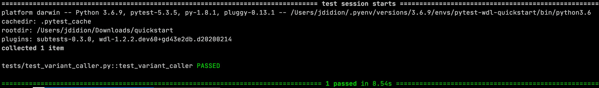

# User manual

pytest-wdl is a plugin for the [pytest](https://docs.pytest.org/en/latest/) unit testing framework that enables testing of workflows written in [Workflow Description Language](https://github.com/openwdl). Test workflow inputs and expected outputs are [configured](#test-data) in a `test_data.json` file. Workflows are run by one or more [executors](#executors). By default, actual and expected outputs are compared by MD5 hash, but data type-specific comparisons are provided. Data types and executors are pluggable and can be provided via third-party packages. 

## Dependencies

* Python 3.6+
* At least one of the supported workflow engines (see [Limitations](#known-limitations) for known limitations of these workflow engines):
    * [Miniwdl](https://github.com/chanzuckerberg/miniwdl) (v0.6.4 is automatically installed as a dependency of pytest-wdl)
    * [Cromwell](https://github.com/broadinstitute/cromwell/releases/) JAR file (pytest-wdl is currently tested with Cromwell v53.1)
    * [dxWDL](https://github.com/dnanexus/dxWDL) JAR file (pytest-wdl is currently tested with dxWDL v1.42)
* Java-based workflow engines (e.g. Cromwell and dxWDL) require a Java runtime (typically 1.8+)
* If your WDL tasks depend on Docker images, make sure to have the [Docker](https://www.docker.com/get-started) daemon running

Other python dependencies are installed when you install the library.

## Installation

### Install from PyPI

```commandline
$ pip install pytest-wdl
```

### Install from source

You can to clone the repository and install:

```
$ make install
```

Or use pip to install from github:

```commandline
$ pip install git+https://github.com/elilillyco/pytest-wdl.git
```

### Install optional dependencies

Some optional features of pytest-wdl have additional dependencies that are loaded on-demand.

The plugins that have extra dependencies are:

* dx: Support for DNAnexus file storage, and for the dxWDL executor.
* bam: More intelligent comparison of expected and actual BAM file outputs of a workflow than just comparing MD5 checksums.
* http: Support for executors that use HTTPS protocol to communicate with a remote server (e.g. Cromwell Server)
* <a name="yaml">yaml</a>: Support using YAML for configuration and test data files. Note that `.yaml` files are ignored if a `.json` file with the same prefix is present.
* progress: Show progress bars when downloading remote files.

To install a plugin's dependencies:

```
$ pip install pytest-wdl[<plugin>]
```

To do this locally, you can clone the repo and run:

```commandline
$ pip install -e .[<data_type>]
```

To install pytest-wdl and **all** extras dependencies:

```
$ pip install pytest-wdl[all]
```

## Quick Start

The full code for this quick-start project is available in the [examples](https://github.com/EliLillyCo/pytest-wdl/tree/develop/examples/quickstart) directory.

To demonstrate how to use pytest-wdl, we will create a simple variant calling workflow and tests with the following project structure:

```
quickstart
|_variant_caller.wdl
|_tests
  |_data
  | |_NA12878.chr22.tiny.vcf
  |_test_data.json
  |_test_variant_caller.py
```

Our workflow is shown below. It requires a BAM file and a reference sequence, it calls a task to perform variant calling using [Freebayes](https://github.com/ekg/freebayes), and it returns a VCF file with the called variants.

```wdl
version 1.0

struct Reference {
  File fasta
  String organism
}

workflow call_variants {
  input {
    File bam
    Reference ref
  }

  call freebayes {
    input:
      bam=bam,
      index=ref
  }
  
  output {
    File vcf = freebayes.vcf
  }
}

task freebayes {...}
```

Now you want to test that your workflow runs successfully. You also want to test that your workflow always produces the same output with a given input. You can accomplish both of these objectives with the following test function, which is in the `tests/test_variant_caller.py` file:

```python
def test_variant_caller(workflow_data, workflow_runner):
    inputs = {
        "bam": workflow_data["bam"],
        "ref": {
            "fasta": workflow_data["reference_fa"],
            "organism": "human"
        }
    }
    expected = workflow_data.get_dict("vcf")
    workflow_runner(
        "variant_caller.wdl",
        inputs,
        expected
    )
```

This test executes a workflow with the specified inputs, and will compare the outputs to the specified expected outputs. The `workflow_data` and `workflow_runner` parameters are [fixtures](https://docs.pytest.org/en/latest/fixture.html) that are injected by the pytest framework at runtime. The `workflow_data` fixture provides the test data files based on the following configuration in the `tests/test_data.json` file. Note that some of the data files are stored remotely (in this case, in the [GitHub repository for FreeBayes](https://github.com/ekg/freebayes/tree/65251646f8dd9c60e3db276e3c6386936b7cf60b/test/tiny)) and are downloaded automatically when needed. Later in the mnaual you'll find [descriptions of these fixtures](#fixtures) and details on how to [configure](#configuration) your tests' inputs, exected outputs, and other parameters.


```json
{
  "bam": {
    "url": "https://.../NA12878.chr22.tiny.bam"
  },
  "reference_fa": {
    "url": "https://.../q.fa"
  },
  "vcf": {
    "name": "NA12878.chr22.tiny.vcf",
    "type": "vcf"
  }
}
```

To run this test, make sure you have pytest-wdl [installed](#installation) and run the following command from within the project folder. The default executor (miniwdl) will be used to execute the workflow. You can configure any of the other supported executors by creating a [configuration file](#configuration).

```
$ pytest -s -vv --show-capture=all
```

This test should run successfully, and you should see output that looks like this:



## Project setup

pytest-wdl should support most project set-ups, including:

```
# simple
myproject
|_workflow.wdl
|_subworkflow1.wdl
|_subworkflow2.wdl
|_tests
  |_test_workflow.py
  |_test_data.json

# multi-module with single test directory
myproject
|_main_workflow.wdl
|_module1
| |_module1.wdl
|_module2
| |_module2.wdl
|_tests
 |_main
 | |_test_main.py
 | |_test_data.json
 |_module1
   |_test_module1.py
   |_test_data.json
 ...

# multi-module with separate test directories
myproject
|_main.wdl
|_module1
| |_module1.wdl
| |_tests
|   |_test_module1.py
|   |_test_data.json
|_module2
| |_...
|_tests
  |_test_main.py
  |_test_data.json
```

By default, pytest-wdl tries to find the files it is expecting relative to one of two directories:

* Project root: the base directory of the project. In the above examples, `myproject` is the project root directory. By default, the project root is discovered by looking for key files (e.g. setup.py), starting from the directory in which pytest is executing the current test. In most cases, the project root will be the same for all tests executed within a project.
* Test context directory: starting from the directory in which pytest is executing the current test, the test context directory is the first directory up in the directory hierarchy that contains a "tests" subdirectory. The test context directory may differ between test modules, depending on the setup of your project:
    * In the "simple" and "multi-module with single test directory" examples, `myproject` would be the test context directory
    * In the "multi-module with separate test directories" example, the test context directory would be `myproject` when executing `myproject/tests/test_main.py` and `module1` when executing `myproject/module1/tests/test_module1.py`.

## Fixtures

All functionality of pytest-wdl is provided via fixtures. As long as pytest-wdl is in your `PYTHONPATH`, its fixtures will be discovered and made available when you run pytest.

The two most important fixtures are:

* [workflow_data](#test_data):+ Provides access to data files for use as inputs to a workflow, and for comparing to workflow output.
* [workflow_runner](#executors): Given a WDL workflow, inputs, and expected outputs, runs the workflow using one or more executors and compares actual and expected outputs.

There are also [several additional fixtures](#configuration) used for configuration of the two main fixtures. In most cases, the default values returned by these fixtures "just work." However, if you need to override the defaults, you may do so either directly within your test modules, or in a [conftest.py](https://docs.pytest.org/en/2.7.3/plugins.html) file.

## Test data

Typically, workflows require inputs and generate outputs. Beyond simply ensuring that a workflow runs successfully, we often want to additionally test that it reproducibly generates the same results given the same inputs.

Test inputs and outputs are configured in a `test_data.json` file (or `test_data.yaml` file if you have the [YAML](#yaml) dependency installed) that is stored in the same directory as the test module. This file has one entry for each input/output. Primitive types map as expected from JSON to Python to WDL. Object types (e.g. structs) have a special syntax. For example, the following `test_data.json` file defines an integer input that is loaded as a Python `int` and then maps to the WDL `Integer` type when passed as an input parameter to a workflow, and an object type that is loaded as a Python dict and then maps to a user-defined type (struct) in WDL:

```json
{
  "input_int": 42,
  "input_obj": {
    "class": "Person",
    "value": {
      "name": "Joe",
      "age": 42 
    }
  }
}
```

### Files

For file inputs and outputs, pytest-wdl offers several different options. Test data files may be located remotely (identified by a URL), located within the test directory (using the folder hierarchy established by the [datadir-ng](https://pypi.org/project/pytest-datadir-ng/) plugin), located at an arbitrary local path, or defined by specifying the file contents directly within the JSON file. Files that do not already exist locally are localized on-demand and stored in the [cache directory](#configuration-file).

Some additional options are available only for expected outputs, in order to specify how they should be compared to the actual outputs.

File data can be defined the same as object data (i.e. "file" is a special class of object type):

```json
{
  "config": {
    "class": "file",
    "value": {
      "path": "config.json"
    }
  }
}
```

As a short-cut, the "class" attribute can be omitted and the map describing the file provided directly as the value. Below is an example `test_data.json` file that demonstrates different ways to define input and output data files:

```json
{
  "bam": {
    "url": "http://example.com/my.bam",
    "http_headers": {
      "auth_token": "TOKEN"
    },
    "digests": {
      "md5": "8db3048a86e16a08d2d8341d1c72fecb"
    }
  },
  "reference": {
    "path": "${REFERENCE_DIR}/chr22.fa"
  },
  "sample": {
    "path": "samples.vcf",
    "contents": "sample1\nsample2"
  },
  "output_vcf": {
    "name": "output.vcf",
    "type": {
      "name": "vcf",
      "allowed_diff_lines": 2
    }
  }
}
```

The available keys for configuring file inputs/outputs are:

* `name`: Filename to use when localizing the file; when none of `url`, `path`, or `contents` are defined, `name` is also used to search for the data file within the tests directory, using the same directory structure defined by the [datadir-ng](https://pypi.org/project/pytest-datadir-ng/) fixture.
* `path`: The local path to the file. If the path does not already exist, the file will be localized to this path. Typically, this is defined as a relative path that will be prefixed with the [cache directory](#configuration-file) path. Environment variables can be used to enable the user to configure an environment-specific path.
* `env`: The name of an environment variable in which to look up the local path of the file.
* `url`: A URL that can be resolved by [urllib](https://docs.python.org/3/library/urllib.html).
    * `http_headers`: Optional dict mapping header names to values. These headers are used for file download requests. Keys are header names and values are either strings (environment variable name) or mappings with the following keys:
        * `env`: The name of an environment variable in which to look up the header value.
        * `value`: The header value; only used if an environment variable is not specified or is unset.
* `contents`: The contents of the file, specified as a string. The file is written to `path` the first time it is requested.
* `digests`: Optional mapping of hash algorithm name to digest. These are digests that have been computed on the remote file and are used to validate the downloaded file. Currently only used for files resolved from URLs.

In addition, the following keys are recognized for output files only:

* `type`: The file type. This is optional and only needs to be provided for certain types of files that are handled specially for the sake of comparison. The value can also be a hash with required key "name" and any other comparison-related attributes (including data type-specific attributes).
* `allowed_diff_lines`: Optional and only used for outputs comparison. If '0' or not specified, it is assumed that the expected and actual outputs are identical.

#### URL Schemes

pytest_wdl uses `urllib`, which by default supports http, https, and ftp. If you need to support alternate URL schemes, you can do so via a [plugin](#plugins). Currently, the following plugins are avaiable:

* `dx` (DNAnexus): requires the `dxpy` module
 
#### Data Types

When comparing actual and expected outputs, the "type" of the expected output is used to determine how the files are compared. If no type is specified, then the type is assumed to be "default."

##### default

The default type if one is not specified.

- It can handle raw text files, as well as gzip compressed files.
- If `allowed_diff_lines` is 0 or not specified, then the files are compared by their MD5 hashes.
- If `allowed_diff_lines` is > 0, the files are converted to text and compared using the linux `diff` tool.

##### vcf

- During comparison, headers are ignored, as are the QUAL, INFO, and FORMAT columns; for sample columns, only the first sample column is compared between files, and only the genotype values for that sample.
- Optional attributes:
    - `compare_phase`: Whether to compare genotype phase; defaults to False.
    
##### bam*:

- BAM is converted to SAM.
- Replaces random UNSET-\w*\b type IDs that samtools often adds.
- One comparison is performed using all rows and a subset of columns that are expected to be invariate. Rows are sorted by name and then by flag.
- A second comparison is performed using all columns and a subset of rows based on filtering criteria. Rows are sorted by coordinate and then by name.
- Optional attributes:
    - `min_mapq`: The minimum MAPQ when filtering rows for the second comparison.
    - `compare_tag_columns`: Whether to include tag columns (12+) when comparing all columns in the second comparison.

\* requires extra dependencies to be installed, see 
[Install Optional Dependencies](#install-optional-dependencies)

## Executors

An Executor is a wrapper around a WDL workflow execution engine that prepares inputs, runs the tool, captures outputs, and handles errors. Currently, the following executors are supported (but aternative executors can be implemented as [plugins](#plugins)):

* [Cromwell](https://cromwell.readthedocs.io/)
    * Local: run Cromwell locally (`executor="cromwell"`)
    * Server: run Cromwell via a remote Cromwell server instance (`executor="cromwell-server"`)
* [Miniwdl](https://github.com/chanzuckerberg/miniwdl): run miniwdl locally in the same process as pytest-wdl (`executor="miniwdl"`)
* [dxWDL](https://github.com/dnanexus/dxWDL): compile tasks/workflows using dxWDL and run them remotely on DNAnexus (`executor="dxwdl"`)

The `workflow_runner` fixture is a callable that runs the workflow using the executor.

The first argument to `workflow_runner` is the path to the WDL file. It is required. It may be an absolute or a relative path; if the latter, it is first searched relative to the current `tests` directory (i.e. `test_context_dir/tests`), and then the project root.
 
The remaining arguments to `workflow_runner` are optional:

* `inputs`: Dict that will be serialized to JSON and provided to the executor as the workflow inputs. If not specified, the workflow must not have any required inputs.
* `expected`: Dict mapping output parameter names to expected values. Any workflow outputs that are not specified are ignored. This parameter can be omitted if, for example, you only want to test that the workflow completes successfully.
* `workflow_name`: The name of the workflow to execute in the WDL script. If not specified, the name of the workflow is extracted from the WDL file.
* `inputs_file`: Specify the inputs.json file to use, or the path to the inputs.json file to write, instead of a temp file.
* `imports_file`: Specify the imports file to use. By default, all WDL files under the test context directory are imported if an `import_paths.txt` file is not provided.
* `executors`: Optional list of executors to use to run the workflow. Each executor will be run in a [subtest](https://github.com/pytest-dev/pytest-subtests). If not specified the [default_executors](#configuration) are used.
* `callback`: An optional function that is called after each successful workflow execution. Take three arguments:

    ```python
    from pathlib import Path
    
    def callback(executor_name: str, execution_dir: Path, outputs: dict):
      ...
    ```

You can also pass executor-specific keyword arguments. 

### Executor-specific `workflow_runner` arguments

#### Cromwell Local

* `imports_file`: Instead of specifying the imports file, this can also be the path to the imports zip file to write, instead of a temp file.
* `java_args`: Override the default Java arguments.
* `cromwell_args`: Override the default Cromwell arguments.

#### Cromwell Server

* `imports_file`: Instead of specifying the imports file, this can also be the path to the imports zip file to write, instead of a temp file.
* `timeout`: Number of seconds to allow a workflow to run before timing out with an error; defaults to 3600 (1hr).

#### Miniwdl

* `task_name`: Name of the task to run, e.g. for a WDL file that does not have a workflow. This takes precedence over `workflow_name`.

#### dxWDL

Requires the `dxpy` package to be installed.

<!--* `task_name`: Name of the task to run, e.g. for a WDL file that does not have a workflow. This takes precedence over `workflow_name`.-->
* `project_id`: ID of the project where the workflow will be built. Defaults to the currently selected project. You can also specify different projects for workflows and data using `workflow_project_id` and `data_project_id` varaibles.
* `folder`: The folder within the project where the workflow will be built. Defaults to '/'. You can also specify different folders for workflows and data using `workflow_folder_id` and `data_folder_id` varaibles.
* `stage_id`: Stage ID to use when inputs don't come prefixed with the stage. Defaults to "stage-common".
* `force`: Boolean; whether to force the workflow to be built even if the WDL file has not changed since the last build.
* `archive`: Boolean; whether to archive existing applets/workflows (True) or overwrite them (False) when building the workflow. Defaults to True.
* `extras`: [Extras file](https://github.com/dnanexus/dxWDL/blob/master/doc/ExpertOptions.md) to use when building the workflow.

### Known limitations

#### Cromwell

* Cromwell issues are tracked in the [Broad's Jira](https://broadworkbench.atlassian.net/projects/BA/issues).

#### miniwdl

* pytest-wdl is currently pinned to [miniwdl version 0.6.4](https://github.com/chanzuckerberg/miniwdl/releases/tag/v0.6.4), which has the following known limitations:
    * Task input files are mounted read-only by default; commands to rename or remove them can succeed only with --copy-input-files
* See the [miniwdl open issues](https://github.com/chanzuckerberg/miniwdl/issues) for other potential limitations

#### dxWDL

* DNAnexus (and thus the dxWDL executor) does not support optional collection types (e.g. `Array[String]?`, `Map[String, File]?`).
* See the [dxWDL open issues](https://github.com/dnanexus/dxWDL/issues) for other potential limitations

## Writing tests in JSON

Rather than writing test cases in Python, in most instances it is possible to define your tests completely in JSON (or in YAML, if you have the [YAML](#yaml) dependency installed). Python- and JSON-based tests can co-exist.

JSON tests are defined in a file that starts with `test` and ends with `.json`. There is one required top-level key, `"test"`, whose value is an array of hashes. Each hash defines a single test.

```json
{
  "tests": [
    {
      "name": "mytest",
      "wdl": "mytest.wdl",
      "inputs": {
        "input_files": [
            "test_file1",
            "test_file2"
        ],
        "organism": "human"
      },
      "expected": {
        "output_file": "expected_file"
      }
    }
  ]
}
```

A test has two required keys:

* `name`: The test name; must be unique within the file.
* `wdl`: A path to a WDL file (equivalent to the first parameter to `workflow_runner` described above).

Any of the other parameters to `workflow_runner` can be specified as keys as well. To refer to `workflow_data` entries, simply use the entry key as a value. For example, "test_file1", "test_file2", and "expected_file" in the example above are defined in the `test_data.json` file. If a string value is not found in the `workflow_data`, it is treated as a string literal. For example, the value of the "organism" key ("human") is treated as a string literal because there is no "human" key defined in `test_data.json`.

Instead of using a separate `test_data.json` file, you may instead put your test data definitions directly in the test JSON file as the value of the "data" key. Note that it is either/or - if you put your test data definitions in your tests JSON file, then any definitions in `test_data.json` will not be ignored.

```json
{
  "data": {
    "test_file": {
      "url": "https://foo.com/input.txt"
    },
    "expected_file": {
      "url": "https://foo.com/output.txt"
    }
  },
  "tests": [
    {
      "name": "mytest",
      "wdl": "mytest.wdl",
      "inputs": {
        "input_file": "test_file",
        "organism": "human"
      },
      "expected": {
        "output_file": "expected_file"
      }
    }
  ]
}
```

## Configuration

pytest-wdl has two levels of configuration: 

* Project-specific configuration, which generally deals with the structure of the project, and may require customization if the structure of your project differs substantially from what is expected, but also encompases executor-specific configuration.
* Environment-specific configuration, which generally deals with idiosyncrasies of the local environment.

### Project-specific configuration

Configuration at the project level is handled by overriding fixtures, either in the test module or in a top-level conftest.py file. The following fixtures may be overridden:

| fixture name | scope | description | default |
| -------------| ----- | ----------- | ------- |
| `project_root_files` | module | List of filenames that are found in the project root directory. | `["setup.py", "pyproject.toml", ".git"]`
| `project_root` | module | The root directory of the project. Relative paths are relative to this directory, unless specified otherwise. | Starting in the current test directory/module, scan up the directory hierarchy until one of the `project_root_files` are located. |
| `workflow_data_descriptor_file` | module | Path to the JSON file that describes the test data. | `tests/test_data.json` |
| `workflow_data_descriptors` | module | Mapping of workflow input/output names to values (as described in the [Files](#files) section). | Loaded from the `workflow_data_descriptor_file` |
| `workflow_data_resolver` | module | Provides the `DataResolver` object that resolves test data; this should only need to be overridden for testing/debugging purposes | `DataResolver` created from `workflow_data_descriptors` |
| `import_paths` | module | Provides the path to the file that lists the directories from which to import WDL dependencies | "import_paths.txt" |
| `import_dirs` | module | Provides the directories from which to import WDL dependencies | Loaded from `import_paths` file, if any, otherwise all WDL files under the current test context directory are imported |
| `default_executors` | session | Specify the default set of executors to use when running tests | `user_config.default_executors` |

### Environment-specific configuration

There are several aspects of pytest-wdl that can be configured to the local environment, for example to enable the same tests to run both on a user's development machine and in a continuous integration environment.

Environment-specific configuration is specified either or both of two places: a JSON configuration file and environment variables. Environment variables always take precendence over values in the configuration file. Keep in mind that (on a *nix system) environment variables can be set (semi-)permanently (using `export`) or temporarily (using `env`):

```commandline
# Set environment variable durably
$ export FOO=bar

# Set environment variable only in the context of a single command
$ env FOO=bar echo "foo is $FOO"
```

#### Configuration file

The pytest-wdl configuration file is a JSON-format file. Its default location is `$HOME/.pytest_wdl_config.json` (or `$HOME/.pytest_wdl_config.yaml` if you have the [YAML](#yaml) dependency installed). To get started, you can copy one of the following example config files and modify as necessary:
 
* [simple](https://github.com/EliLillyCo/pytest-wdl/blob/develop/examples/config/simple.pytest_wdl_config.json): Uses only the miniwdl executor
* [more complex](https://github.com/EliLillyCo/pytest-wdl/blob/develop/examples/config/complex.pytest_wdl_config.json): Uses both miniwdl and Cromwell; shows how to configure proxies and headers for accessing remote data files in a private repository

The available configuration options are listed in the following table:

| configuration file key | environment variable | description | default | recommendation|
| -------------| ------------- | ----------- | ----------- | ----------- |
| `cache_dir` | `PYTEST_WDL_CACHE_DIR` | Directory to use for localizing test data files. | Temporary directory; a separate directory is used for each test module | pro: saves time when multiple tests rely on the same test data files; con: can cause conflicts, if tests use different files with the same name |
| `execution_dir` | `PYTEST_WDL_EXECUTION_DIR` | Directory in which tests are executed | Temporary directory; a separate directory is used for each test function | Only use for debugging; use an absolute path |
| `proxies` | Configurable | Proxy server information; see details below | None | Use environment variable(s) to configure your proxy server(s), if any |
| `http_headers` | Configurable | HTTP header configuration that applies to all URLs matching a given pattern; see details below | None | Configure headers by URL pattern; configure headers for specific URLs in the test_data.json file |
| `show_progress` | N/A | Whether to show progress bars when downloading files | False | |
| `default_executors` | PYTEST_WDL_EXECUTORS | Comma-delimited list of executor names to run by default | \["cromwell"\] | |
| `executors` | Executor-dependent | Configuration options specific to each executor; see below | None | |
| `providers` | Provider-dependent | Configuration options specific to each provider; see below | None | |
| N/A | `LOGLEVEL` | Level of detail to log; can set to 'DEBUG', 'INFO', 'WARNING', or 'ERROR' | 'WARNING' | Use 'DEBUG' when developing plugins/fixtures/etc., otherwise 'WARNING' |

##### Proxies

In the proxies section of the configuration file, you can define the proxy servers for schemes used in data file URLs. The keys are scheme names and the values are either strings - environment variable names - or mappings with the following keys:

* `env`: The name of an environment variable in which to look for the proxy server address.
* `value`: The value to use for the proxy server address, if the environment variable is not defined or is unset.

```json
{
  "proxies": {
    "http": {
      "env": "HTTP_PROXY"
    },
    "https": {
      "value": "https://foo.com/proxy",
      "env": "HTTPS_PROXY"
    }
  }
}
```

##### HTTP(S) Headers

In the http_headers section of the configuration file, you can define a list of headers to use when downloading data files. In addition to `env` and `value` keys (which are interpreted the same as for [proxies](#proxies), two additional keys are allowed:

* `name`: Required; the header name
* `pattern`: A regular expression used to match the URL; if not specified, the header is used with all URLs.

```json
{
  "http_headers": [
    {
      "name": "X-JFrog-Art-Api",
      "pattern": "http://my.company.com/artifactory/*",
      "env": "TOKEN"
    }
  ]
}
```

##### Executor-specific configuration

###### Java-based Executors

These options apply to all Java-based executors (currently Cromwell and dxWDL):

| configuration file key | environment variable | description | default |
| -------------| ------------- | ----------- | ----------- |
| `java_bin` | `JAVA_HOME` | Path to java executable; If not specified, then Java executable is expected to be in $JAVA_HOME/bin/java | None |
| `java_args` | `JAVA_ARGS` | Arguments to add to the `java` command | `-Dconfig.file=<cromwell_config_file>` (for Cromwell executor, if `cromwell_config_file` is specified) |
| N/A | `CLASSPATH` | Java classpath; searched for a file matching "cromwell*.jar" if `cromwell_jar` is not specified | None |

###### Cromwell Local

| configuration file key | environment variable | description | default |
| -------------| ------------- | ----------- | ----------- |
| `cromwell_jar_file` | `CROMWELL_JAR` | Path to Cromwell JAR file | None |
| `cromwell_configuration` | `CROMWELL_CONFIG` | Path to Cromwell configuration file | None |
| `cromwell_args` | `CROMWELL_ARGS`  | Arguments to add to the `cromwell run` command | None; |

Note that if you are doing your development locally and using Docker images you've built yourself, it is recommended to add `-Ddocker.hash-lookup.enabled=false` to `java_args` to disable Docker lookup by hash. Otherwise, you must push your Docker image(s) to a remote repository (e.g. DockerHub) before running your tests.

###### Cromwell Server

* `cromwell_api_url`: The full path to the cromwell API (i.e. http://localhost:8000/api/workflows/v1).
* `cromwell_api_username`: The username to authenticate against the cromwell api if protected
* `cromwell_api_password`: The password to authenticate against the cromwell api if protected 
* `cromwell_configuration`: Configuration (file or dict) to pass to cromwell when submitting run requests.

###### dxWDL

The dxWDL executor (as well as URLs using the `dx://` scheme) require you to be logged into DNAnexus. You can configure either a username and password or an auth token in the config file to log in automatically (see [provider configuration](#dnanexus)), otherwise you will be asked to log in interactively.

| configuration file key | environment variable | description | default |
| -------------| ------------- | ----------- | ----------- |
| `dxwdl_jar_file` | `DXWDL_JAR` | Path to dxWDL JAR file | None |
| `dxwdl_cache_dir` | `DXWDL_CACHE_DIR` | Directory to use to cache downloaded results | A temporary directory is used and deleted after each test |

##### Provider-specific configuration

A "provider" is a remote (generally cloud-based) service that provides both an execution engine and data storage.

###### DNAnexus

| configuration file key | environment variable | description | default |
| -------------| ------------- | ----------- | ----------- |
| `dx_username` | None | Username to use for logging into DNAnexus if the user is not already logged in | None |
| `dx_password` | None | Password to use for logging into DNAnexus if the user is not already logged in | None |
| `dx_token` | None | Token to use for logging into DNAnexus if the user is not already logged in (mutually exclusive with username/password | None |

##### Fixtures

There are two fixtures that control the loading of the user configuration:

| fixture name | scope | description | default |
| -------------| ----- | ----------- | ------- |
| `user_config_file` | session | The location of the user configuration file | The value of the `PYTEST_WDL_CONFIG` environment variable if set, otherwise `$HOME/.pytest_wdl_config.json`  |
| `user_config` | session | Provides a `UserConfiguration` object that is used by other fixtures to access configuration values | Default values are loaded from `user_config_file`, but most values can be overridden via environment variables (see [Configuration](#configuration)) |

## Plugins

pytest-wdl provides the ability to implement plugins for data types, executors, and url schemes. When two plugins with the same name are present, the third-party plugin takes precedence over the built-in plugin (however, if there are two conflicting third-party plugins, an exception is raised).

### Creating new data types

To create a new data type plugin, add a module in the `data_types` package of pytest-wdl, or create it in your own 3rd party package.

Your plugin must subclass the `pytest_wdl.data_types.DataFile` class and override its methods for `_assert_contents_equal()` and/or `_diff()` to define the behavior for this file type.

Next, add an entry point in setup.py. If the data type requires more dependencies to be installed, make sure to use a `try/except ImportError` and raise a PluginError with an informative message, and to add the extra dependencies under the setup.py's `extras_require`. For example:

```python
# plugin.py
from pytest_wdl.plugins import PluginError

try:
    import mylib
except ImportError as err:
    raise PluginError(
        "mytype is not available because the mylib library is not "
        "installed"
    ) from err
```

```python
from setuptools import setup

setup(
    ...,
    entry_points={
        "pytest_wdl.data_types": [
            "mydata = pytest_wdl.data_types.mytype:MyDataFile"
        ]
    },
    extras_require={
        "mydata": ["mylib"]
    }
)
```

In this example, the extra dependencies can be installed with `pip install pytest-wdl[mydata]`.

### Creating new executors

To create a new executor, add a module in the `executors` package, or in your own 3rd party package.

Your plugin must subclass `pytest_wdl.executors.Executor` and implement an initalizer and the `run_workflow()` method. The initalizer must take `import_dirs: Optional[Sequence[Path]]` as its first argument, and may take additional executor-specific keyword arguments.

```python
from pathlib import Path
from pytest_wdl.executors import Executor
from typing import Optional, Sequence

class MyExecutor(Executor):
    def __init__(
        self,
        import_dirs: Optional[Sequence[Path]],
        myarg: str = "hello"
    ):
        ...

    def run_workflow(
        self,
        wdl_path: Path,
        inputs: Optional[dict] = None,
        expected: Optional[dict] = None,
        **kwargs
    ) -> dict:
        ...
```

Next, add an entry point in setup.py. If the executor requires more dependencies to be installed, make sure to use a `try/except ImportError` to warn about this and add the extra dependencies under the setup.py's `extras_require` (see example under [Creating new data types](#creating-new-data-types)). For example:

```python
from setuptools import setup

setup(
    ...,
    entry_points={
        "pytest_wdl.executors": [
            "myexec = pytest_wdl.executors.myexec:MyExecutor"
        ]
    },
    extras_require={
        "myexec": ["mylib"]
    }
)
```

### Supporting alternative URL schemes

If you want to use test data files that are available via a service that does not support http/https/ftp downloads, you can implement a custom URL scheme.

Your plugin must subclass `pytest_wdl.url_schemes.UrlScheme` and implement the `scheme`, `handles`, and any of the `urlopen`, `request`, and `response` methods that are required.

Next, add an entry point in setup.py. If the schem requires more dependencies to be installed, make sure to use a `try/except ImportError` to warn about this and add the extra dependencies under the setup.py's `extras_require` (see example under [Creating new data types](#creating-new-data-types)). For example:

```python
from setuptools import setup

setup(
    ...,
    entry_points={
        "pytest_wdl.url_schemes": [
            "myexec = pytest_wdl.url_schemes.myscheme:MyUrlScheme"
        ]
    },
    extras_require={
        "myexec": ["mylib"]
    }
)
```
